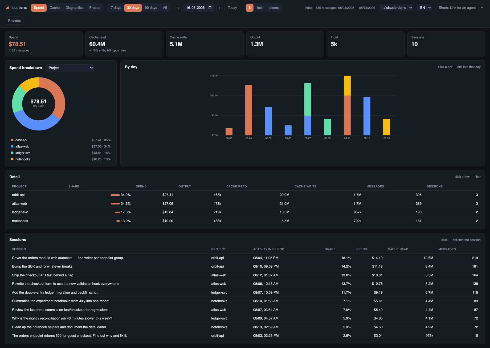
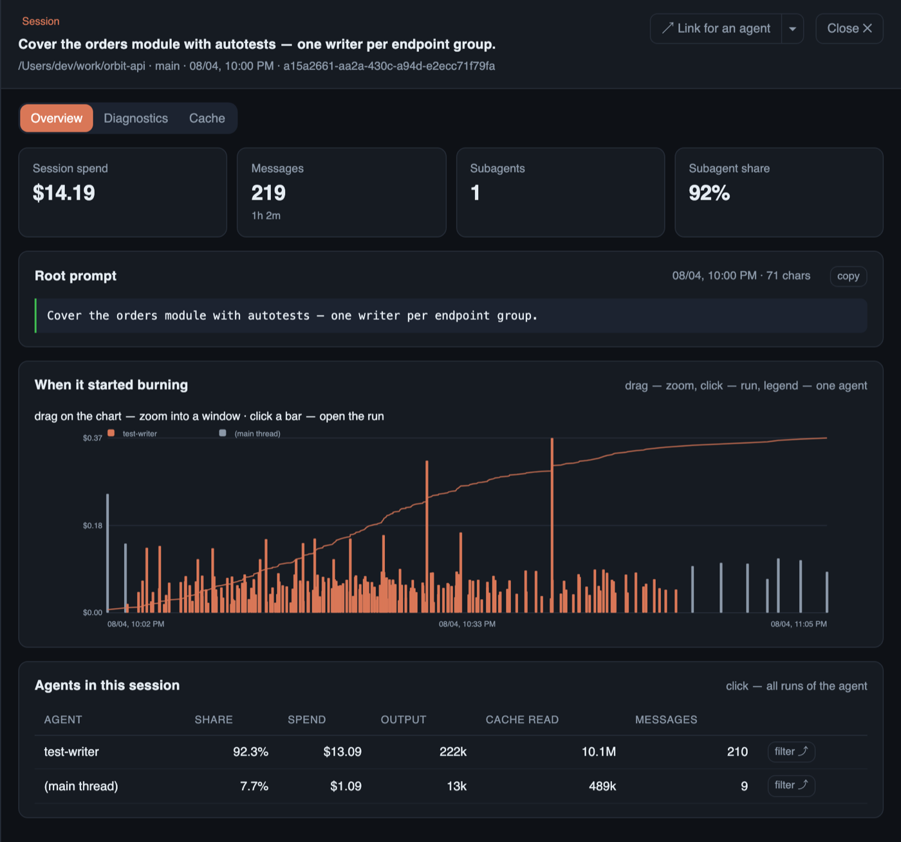
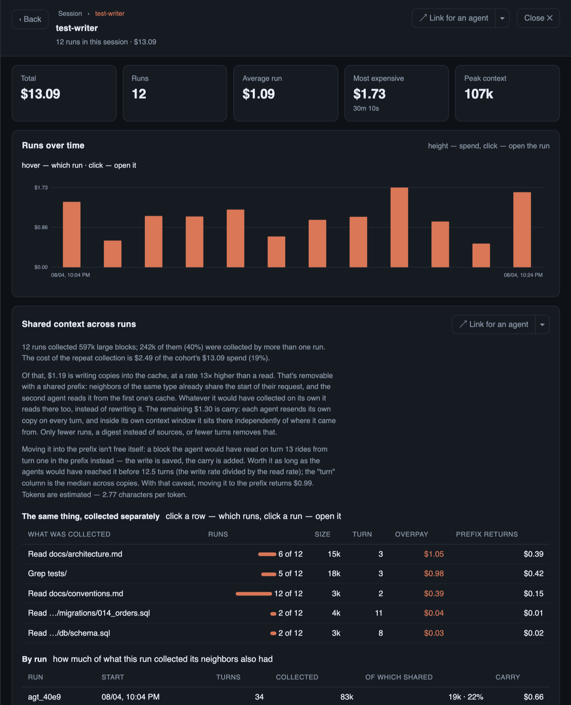
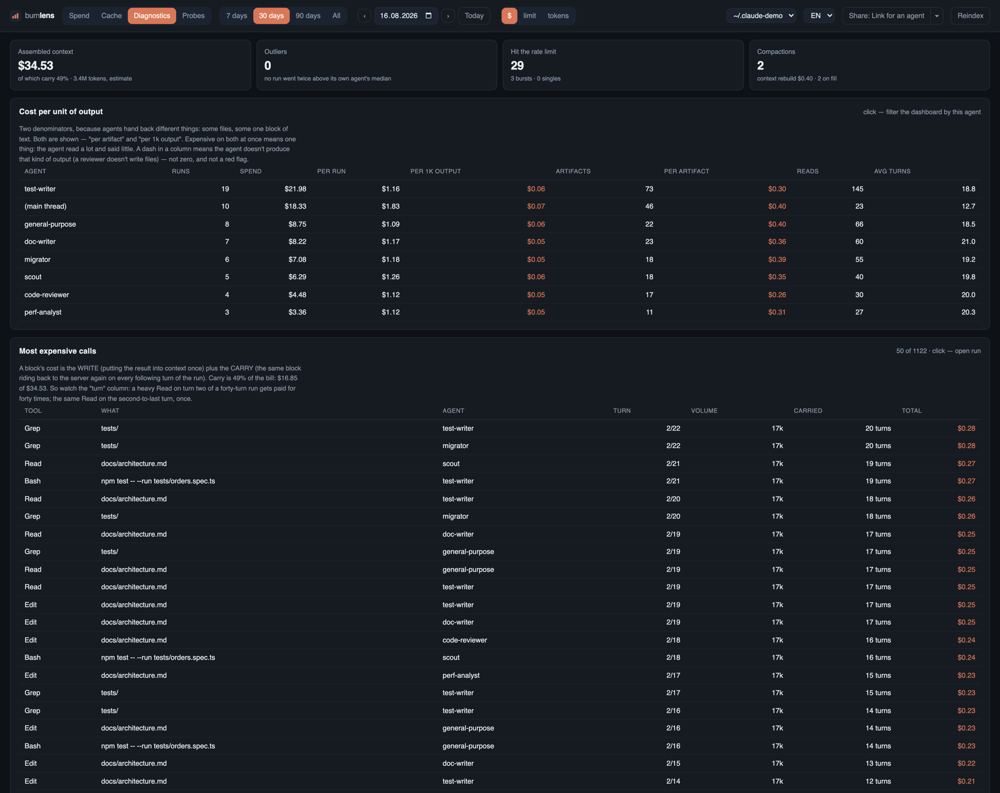
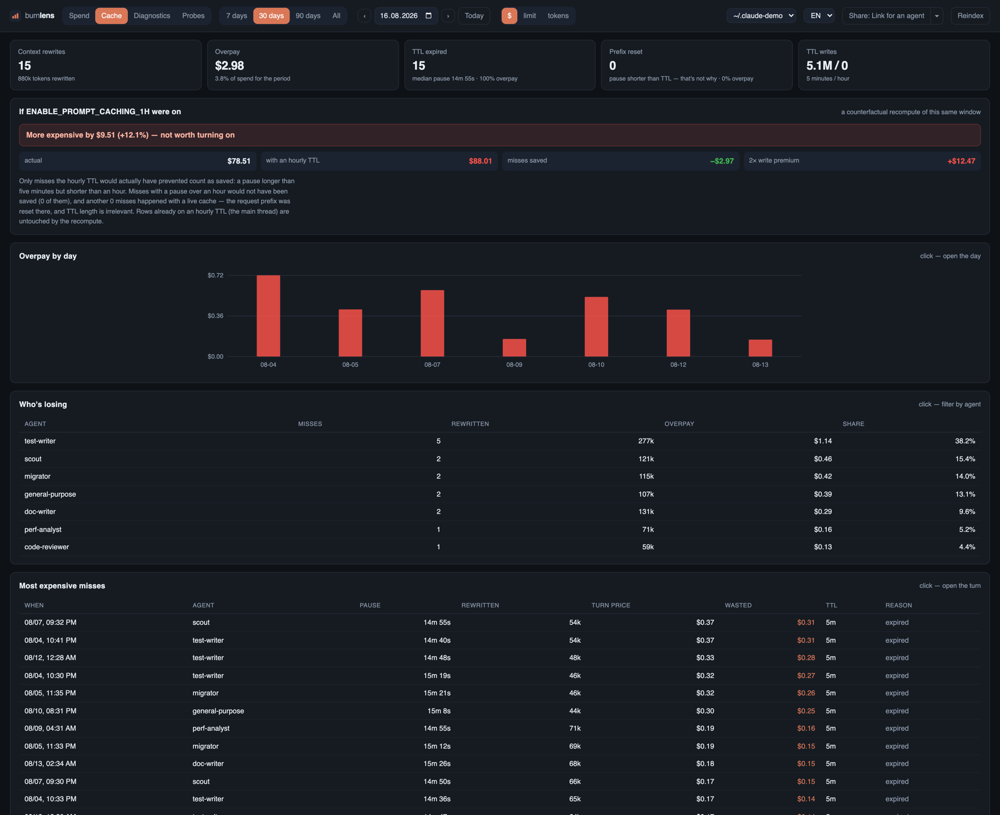
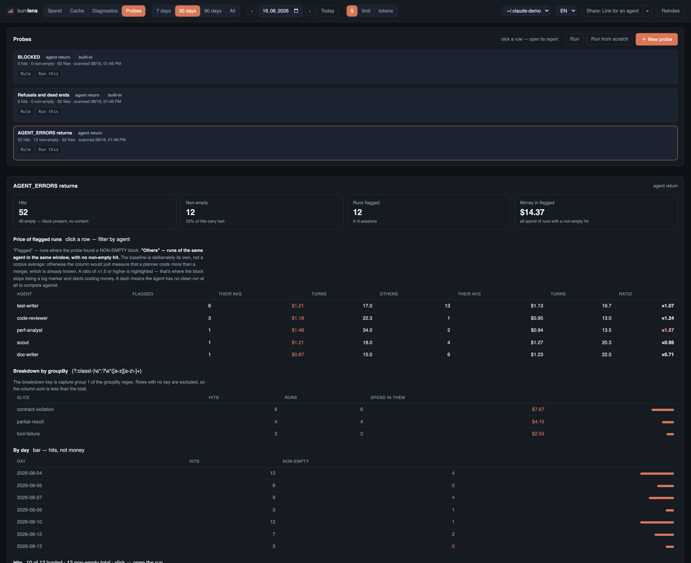

# burnlens

Where the tokens in Claude Code actually go. A global breakdown by project,
agent, model and day — with a drill-down into one session to see exactly
when and which agent started burning money.

No runtime dependencies. Node 24+ (`node:sqlite`), plain ES modules and
hand-rolled SVG in the browser.

```bash
npx burnlens serve          # dashboard on http://127.0.0.1:4317
```

Or from a checkout, where the TypeScript sources run as they are — Node
strips the types, there is nothing to build:

```bash
git clone https://github.com/Graf2242/burnlens && cd burnlens
node src/cli.ts serve
```

`serve` brings the server up **before** indexing, so the dashboard responds
immediately and the index finishes in the background. Nothing leaves the
machine: the server listens on `127.0.0.1` only, and the index stores the
opening replies of your prompts.

## What it looks like

Every screen below is the real dashboard over a **generated** corpus — 10
sessions, 62 log files, ~1100 messages of synthetic traffic across four
made-up projects. No real logs, so the dollar amounts are small and the
project names are invented; the shapes and the arithmetic are the tool's own.
Reproduce it yourself:

```bash
node scripts/gen-demo-corpus.mjs /tmp/demo/projects
node src/cli.ts serve --root=/tmp/demo/projects --db=/tmp/demo/index.db
```

The images themselves are produced by `scripts/capture-screenshots.mjs`,
which drives headless Chrome over the DevTools protocol (`CHROME_BIN` to
point it at a different binary).

**Spend** — the global picture: totals, a breakdown by project (or agent,
model, kind), spend by day, and the sessions behind it. Click a bar to drill
into that day, a row to filter, a session to open it.



**Session** — the root prompt in full, then every message of the main thread
and all subagents on one clock. Drag to zoom and the KPIs recompute for that
window; click a bar to jump to the run that produced it.



**Shared context across runs** — the flagship view. Twelve `test-writer` runs
each read the same files on their own; every individual run looks clean. The
panel prices what the fan-out collected twice, and splits it into the half a
shared prefix can fix (write) and the half only fewer runs or fewer turns can
(carry).



**Diagnostics** — what went wrong with the money: cost per unit of result,
the calls that cost the most once carry is counted, run tails, rate-limit
bursts, compactions. The baseline is always the agent's own median, never a
fixed threshold.



**Cache** — what it cost that the cache didn't work, split by cause, plus a
recompute of the whole window as if writes had used the hour-long TTL. Here
the verdict is negative: +$9.51, so `ENABLE_PROMPT_CACHING_1H` would lose
money on this corpus.



**Probes** — your own regex over the logs, where a hit flags a run and a run
has a price. Flagged runs are compared against the same agent's other runs in
the same window, so a rule answers "what did this cost", not just "how many".



## Commands

```bash
node src/cli.ts index     # build/update the index (incremental)
node src/cli.ts serve     # dashboard
node src/cli.ts report    --days 30 --by kind,project,agent
node src/cli.ts diag      # outliers, cost per unit of result, expensive calls, tails
node src/cli.ts cohort    # where a subagent fan-out collected the same context
node src/cli.ts probe     # your own regex rules over the logs, priced by run
node src/cli.ts show 'bl://cohort?session=<id>&agent=<name>'   # a finding for an agent
node src/cli.ts sources   # which Claude folders the spend is computed over
```

`npm i -g burnlens` (or `npm link` from a checkout) puts `burnlens` on `PATH`;
every `node src/cli.ts X` below is then just `burnlens X`.

The published package ships compiled JavaScript in `dist/`, built by
`npm run build` and wired to `prepack`, because Node refuses to strip types
from files under `node_modules` — a `.ts` entry point works from a checkout
and nowhere else. Running from a clone still needs no build; the sources are
the program.

## What's on the screens

**Spend.** Totals and breakdowns by project, agent, model and day, over a
preset period (7/30/90 days, all) or a single day — a date field, `‹ ›`
arrows, or a click on a bar. In day mode the chart switches to hourly, so a
spike at 03:00 shows up at 03:00. The selected day and open session land in
the URL (`#day=…`, `#session=…`), so a view can be bookmarked.

**Session window.** A navigation stack with breadcrumbs, four levels deep:

1. *Session* — the root prompt in full (including a slash command's expanded
   body), a timeline of all messages with main thread and subagents on one
   clock, and a table of agents. Dragging on the timeline zooms into a
   window and recomputes the KPIs and the agent table for it; clicking a bar
   jumps to the run that produced it.
2. *Agent* — every run of that agent in the session, plus "Shared context
   across runs" (below).
3. *Run* — a context chart by turn (cache read / cache write / input, with
   price bars on the right scale) and the full history. Each turn spells its
   price out: `context 175k = read 0 + write 175k + input 2 · output 5 ·
   $3.29`. Tool calls show their full arguments, and results are matched to
   calls by `tool_use_id`, not by adjacency.
4. *Context composition* — what the context is actually made of, by **who
   put the text there**: subagent returns, your own `Write`/`Edit`, plans,
   reasoning, dispatch briefs, tool results. Duplicates are found by
   shingling: on a measured run, 91k tokens — 20% of context — were copies
   of the same documents. Read from JSONL on demand, which is why a 1 GB
   corpus lives in a 4 MB index with history intact.

**Cache.** How much it cost that the cache didn't work. A miss is defined by
comparison, not a threshold — a turn rewrites what the previous turn already
cached, while reading almost nothing — and is split by cause: *TTL expired*
versus *prefix evicted* (a short pause, so the write was still alive; the
head of the request changed — a tool schema reloaded, the skill list
updated). The screen also reprices the whole window as if writes had used
the hour-long TTL, which answers `ENABLE_PROMPT_CACHING_1H` with a number
instead of an opinion. On the measured corpus that verdict was negative:
**+$642 (+9.6%)** — $181 of saved misses against an $824 surcharge.

**Diagnostics.** What went wrong with the money. The baseline is always the
flow's own history, never an absolute threshold.

- *Outliers* — a run against the median run of the same agent (2× and up,
  minimum five runs). Agents with no fixed task, the main thread and
  `general-purpose`, are excluded: a two-turn question and a whole refactor
  under one name have no meaningful median.
- *Cost per unit of result* — spend per artifact (`Write`/`Edit`/
  `StructuredOutput`) plus 1k output tokens.
- *Most expensive calls* — a tool result scored by size × carry time, not
  size. One 674k-character `Read` arriving on turn 29 of 362 cost $29; over
  30 days, 52% of that $3937 total was carrying, not writing.
- *Run tail* — turns after the last artifact was written. Runs that wrote
  nothing are excluded: for a reviewer, returning text *is* the work.
- *Heavy briefs* — what the orchestrator resends on every dispatch (largest
  in the corpus: ~15k tokens in one brief).
- *What happened to runs* — compactions, `429` bursts, failed calls (with
  the error text and a click into the history at that turn), and responses
  cut off by `max_tokens` or by the user.

The same report, scoped to one session, is a tab in the session window —
there the outlier median comes from the agent's whole history, since a
session rarely holds five runs of one agent.

**Probes.** Your own regex rules over the logs, where a hit flags a run and
a run has a price — the thing a plain grep can't do. Two fields make a rule
usable: `scope` (which piece of log text the regex sees — `return`,
`assistant`, `thinking`, `prompt`, `dispatch`, `write`, `tool_result:Read`,
`any`; the difference between "anywhere" and "in a subagent's return" was a
factor of 56 on the motivating case) and `emptyIf` (a project's own
convention for what counts as an empty finding). The report compares flagged
runs against the same agent's other runs in the same window, and `groupBy`
adds a second regex over the finding's text.

Rules live in `~/.claude/burnlens/probes.json`; two starter rules ship out of
the box. The UI editor has a "Check" button that runs a rule against the
latest files without writing to the database. Hits are stored and computed
separately from the index, because a rule changes far more often than the
logs: three probes over 1794 files take 3.4s, a repeat run 0.02s.

## Shared context across runs

A workflow launches thirty `test-writer` runs. Each starts blank and,
independently of its siblings, reads the same adapter, design and rule files.
Every individual run's report looks clean — each file read exactly once. It
was read thirty-one times across the cohort.

The panel sits at the agent level, where the siblings are. The unit of
duplication is **content, not path** (a hash of the normalized text, so the
same document under `E:/…` and `E:\…`, or read via `Read` in one agent and
`Grep` in another, collapses into one group), and a block costs its size
**times how long it gets carried**.

Measured on a fan-out of 32 runs: 70% of everything collected was collected
more than once — $94 of $200. Top line: `adapter.md`, 13.7k tokens, read by
31 of 32 runs, $25.

The report splits that into two sums, because they're fixed differently:

- **Write — $31.** Each agent writes its own copy to cache at 12.5× the read
  rate. A shared prefix fixes this, and the mechanism demonstrably works: 22
  of the 32 subagents read ~12k from a neighbor's cache on their first turn.
- **Carry — $63.** Each agent resends its copy on every later turn. A shared
  prefix does *not* help here — only fewer runs, fewer turns, or a digest
  instead of the sources.

Moving a block into the prefix isn't free: it then travels from turn 1
instead of turn `k`, so the break-even is `k = write_rate / read_rate` ≈
12.5 turns on Opus. The report only counts copies where the trade pays off —
with that correction, a shared prefix would return $17 of the $94.

```bash
node src/cli.ts cohort                                  # find the worst fan-outs
node src/cli.ts cohort --session <id> --agent test-writer [--workflow <id>]
```

## Hand a finding to an agent

Every screen has an address, and a "Share" button offers the same finding in
four forms: an HTTP link, the JSON payload, markdown, or a ready CLI
command. A link is **the address of a finding, not a snapshot** —
`bl://cohort?session=…&agent=…` is recomputed from the index at request
time, so an agent that opens it tomorrow sees tomorrow's numbers.

Following it returns markdown: the same tables as on screen, plus a "Where
next" block linking to neighboring slices, so an agent can walk a finding on
its own.

```bash
burnlens show 'bl://run?session=<id>&run=<runId>'            # markdown
burnlens show 'bl://cohort?session=<id>&agent=test-writer' --json
burnlens show                                                # list of link types
curl 'http://127.0.0.1:4317/s/context?session=<id>&run=<runId>&format=json'
```

Link types mirror the dashboard's levels: `overview`, `cache`, `session`,
`agent`, `run`, `context`, `cohort`, `diag`, `probe`. The full reference with
required parameters is served at `/s` and printed by `show` with no
arguments. Both channels go through one resolver and one renderer
(`src/share.ts`), so they can't drift apart. Digests stay paste-sized: 2–17
KB of markdown against 3–45 KB of JSON for the same data.

## Multiple accounts

A second subscription lives in its own folder (say `~/.claude-personal`) with
its own `projects/` tree. The selector in the top right switches sources;
`＋ Add folder…` takes a path.

Sources are **never mixed** — each gets its own index
(`~/.claude/burnlens/index-<id>.db`), because it's different money. The folder
list lives in `~/.claude/burnlens/sources.json`; removing a folder with `✕`
leaves its index on disk, so adding it back recomputes nothing.

```bash
node src/cli.ts sources
node src/cli.ts report --source ~/.claude-personal --days 7
```

## Metrics

Switched in the toolbar, all three from the same counters:

| Metric | What it is |
|---|---|
| `$` | dollars at API list price |
| `limit` | weighted tokens — the form subscription limits are counted in |
| `tokens` | raw token sum, unweighted |

Multipliers live in `src/pricing.ts`. Pricing is public, limit weights are
not, so `weighted` is derived proportionally and adjusted in one place.

## What matters about the data

Five things it is easy to build a wrong number on. All verified against a
corpus of 1509 files (1 GB, ~21k messages).

1. **Deduplicate by `message.id`.** An assistant turn is written as one line
   per content block, and every line carries identical `message.usage`:
   29,803 of 50,182 lines are such repeats, so counting by line overstates
   spend ~2.5×. Not `requestId` — one request can hold several billable
   messages (`usage.iterations`).
2. **The duplicate lines aren't quite identical.** Early lines hold an
   intermediate streaming `output_tokens`; the real value arrives on the last
   one. Keeping the first line undercounted output by 2.35×. So lines are
   **merged** — each counter takes the max — and iterations are summed, then
   cross-checked against the top level.
3. **Subagents live separately and nested** — `<session>/subagents/*.jsonl`,
   and workflow runs one level deeper under `subagents/workflows/<wfId>/`.
   That's 47% of spend; walking only `<project>/*.jsonl` loses half of it.
4. **Cache is written at two rates.** `ephemeral_1h_input_tokens` costs 2×
   input, the five-minute one 1.25×. Collapsing them undercounts noticeably.
5. **A project's name isn't its folder name.** The folder is the cwd with
   `/` replaced by `-`, so `second-head` reads as `.../second/head`. The real
   path is the `cwd` field inside the files.

Symlinked subagent files (an agent that outlived its session) are skipped —
the target is indexed at its own location. Attribution by agent needs no
reconstruction: subagent lines carry `attributionAgent`, `effort` and
`sessionKind`.

## Text and localization

Not one user-facing string lives in the code: everything a person reads is
in `locales/<code>.json` (today `ru.json` and `en.json`), addressed by key.

Pluralization isn't hand-written — a catalog leaf is an object of CLDR
categories and native `Intl.PluralRules` picks the form, so Russian gets
honest `one/few/many` and any language added later works without a line of
code about its grammar. Numbers and dates go through `Intl` on the catalog's
locale.

The browser switches language from the toolbar (stored in
`localStorage['bl:locale']`, default English); the CLI reads `BURNLENS_LOCALE`.
A new language is one file plus that variable.

```bash
npm run check     # tsc --noEmit + i18n:lint
```

`i18n:lint` fails if a key referenced in code doesn't resolve in a catalog,
or if a stray Cyrillic literal creeps back into source. There is no test
runner in this repo — `npm run check` is the verification.

## Glossary

| Term | Meaning |
|---|---|
| `diag` | the Diagnostics screen — cost breakdowns plus what happened to runs |
| `probe` | your own regex rule over the logs, whose hits are priced by run |
| `cohort` | what a subagent fan-out collected separately, and what it cost |
| `throttle` | `429` responses gathered into bursts — about the shape of the work, not directly about money |
| `weighted` | one of three metrics: weighted tokens, the form subscription limits use |

These are also catalog keys, URL segments and CLI names, so renaming one is
a breaking change to the public contract, not a text edit.

## Layout

| File | Responsibility |
|---|---|
| `src/paths.ts` | walking the `~/.claude/projects` tree, its layout and pitfalls |
| `src/sources.ts` | registry of Claude folders: own root and own index per source |
| `src/parse.ts` | streaming JSONL, dedup, counters, facts, attribution |
| `src/pricing.ts` | three metrics from five counters |
| `src/db.ts` | SQLite index, fact versioning, incrementality by (path, mtime, size) |
| `src/queries.ts` | aggregates: breakdowns, daily series, session timeline |
| `src/cachemiss.ts` | the "cache went stale" rule, shared by both consumers |
| `src/cache.ts` | the cache-miss report and the hour-TTL recomputation |
| `src/runs.ts` | a single run's history, read from JSONL on demand |
| `src/prompt.ts` | a session's root prompt and slash-command expansion |
| `src/context.ts` | context composition: breakdown by source, duplicate search |
| `src/cohort.ts` | what a subagent fan-out collected separately |
| `src/estimate.ts` | characters→tokens, and a block's price given carry-over |
| `src/diag.ts` | cost diagnostics: census, outliers, cost per unit of result |
| `src/health.ts` | what happened: compactions, rate limits, errors, cutoffs |
| `src/probeconfig.ts` | probe rules: storage, validation, built-ins |
| `src/probes.ts` | the probe engine: running over logs, reporting, run badges |
| `src/proberunner.ts` | one probe run per source, same shape as indexing |
| `src/indexer.ts` | one indexing pass, dedup of parallel runs |
| `src/share.ts` | a finding's address: parsing, recomputation, markdown |
| `src/server.ts` | the localhost API, `/s/<view>`, static assets |
| `src/i18n.ts` | Node side of the catalog: `t` and formatters |
| `locales/i18n.js` | the message engine, shared by both runtimes |
| `web/` | the dashboard: `app.js` (spend, cache), `diag.js`, `probes.js`, `ui.js` |

The primary index is `~/.claude/burnlens/index.db` (`--db` to move it,
`BURNLENS_DB` to override globally); added folders get `index-<id>.db` next to
it. A full rebuild of 1800 files takes about 7 seconds, incremental a
fraction of a second. Exactly one pass runs at a time — a click on top of
startup indexing joins the running pass instead of opening a second
transaction.

## License

MIT — see [LICENSE](./LICENSE).
